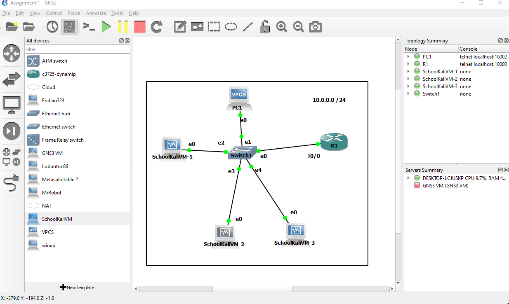
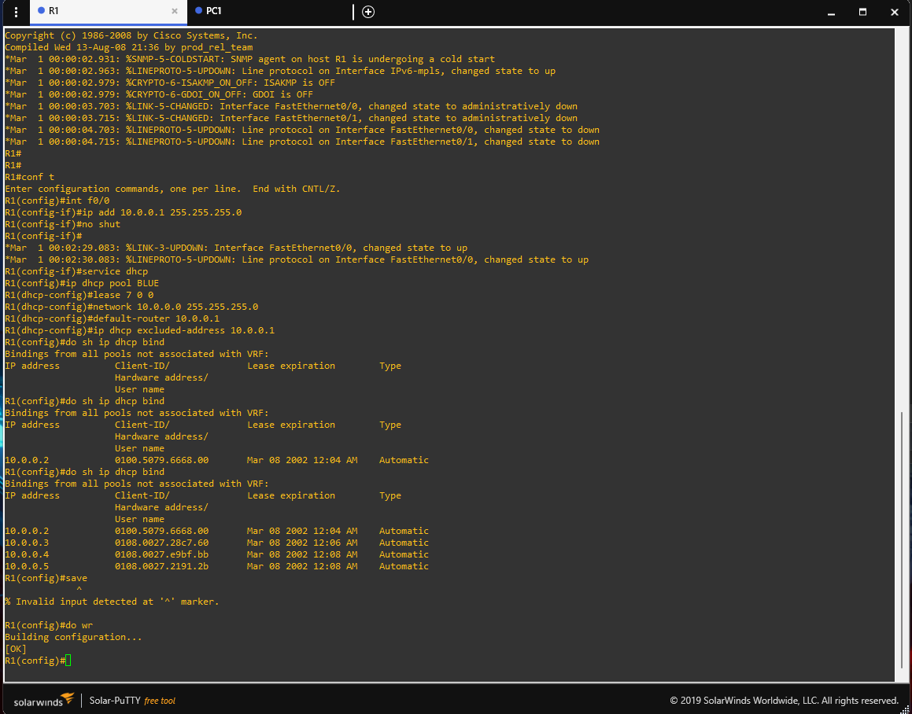
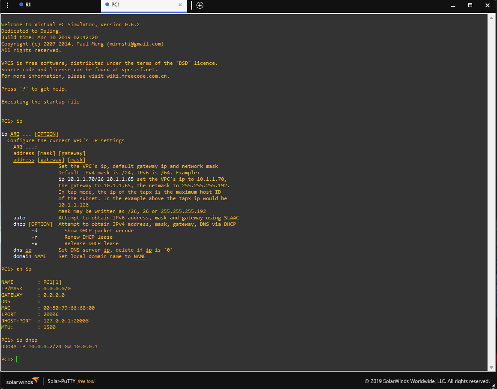
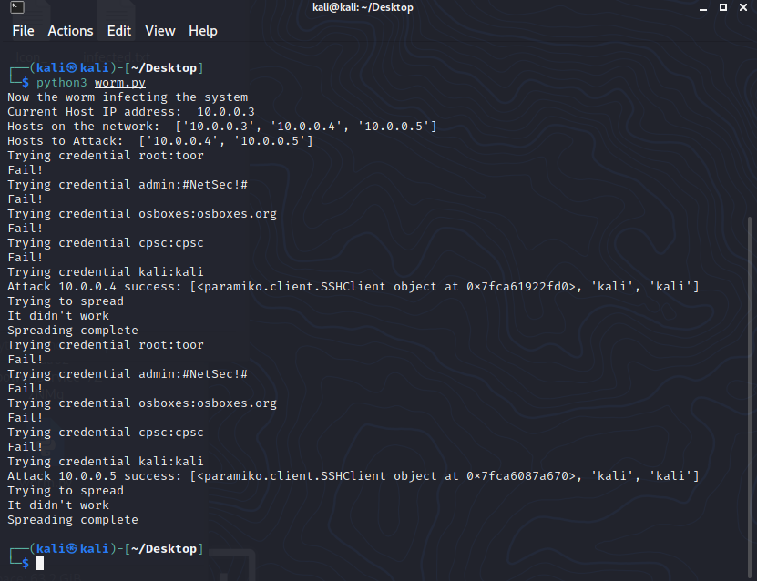
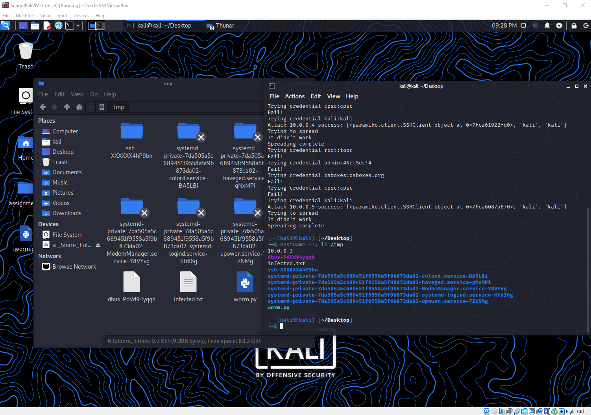
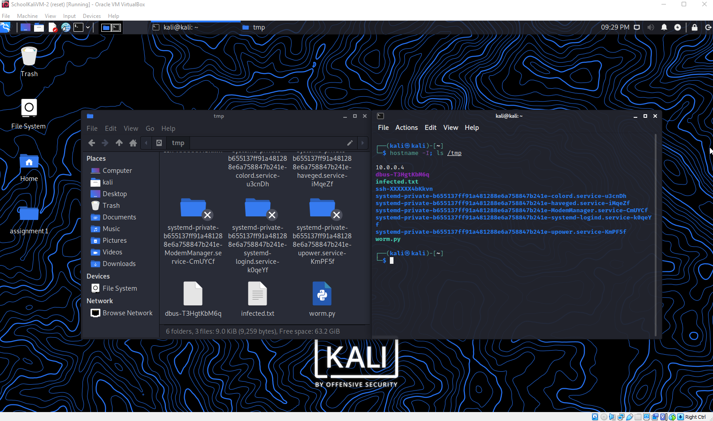
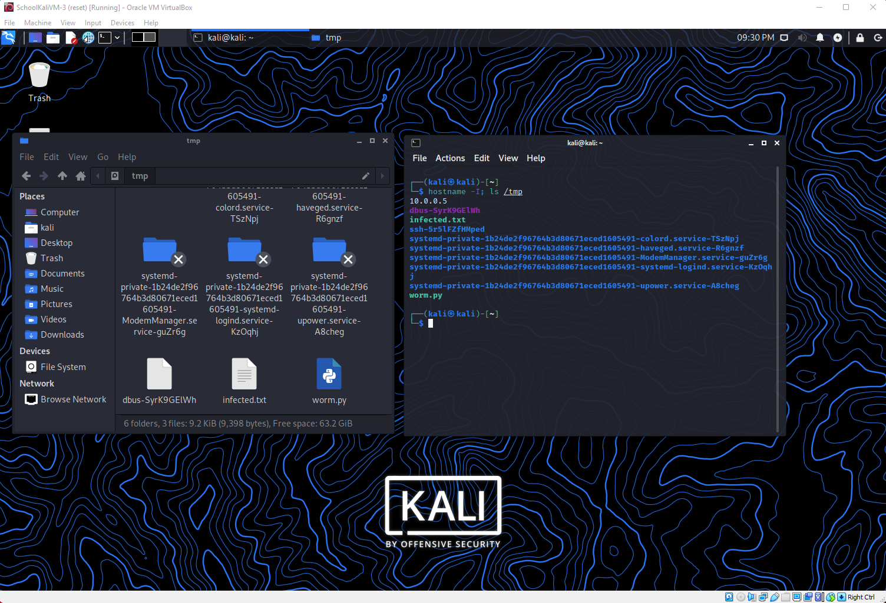
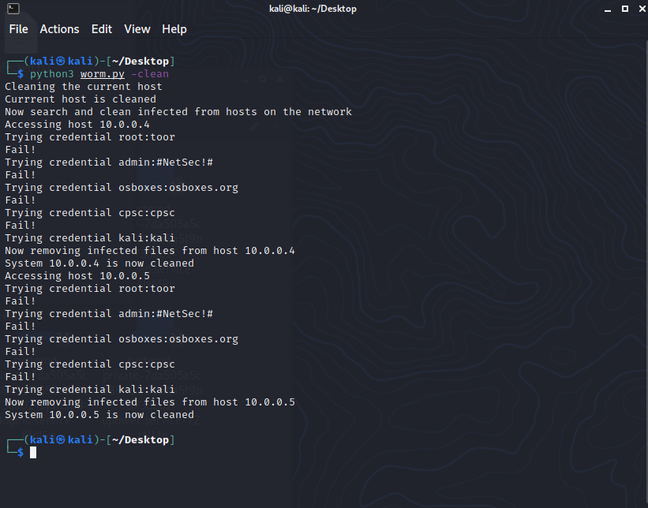
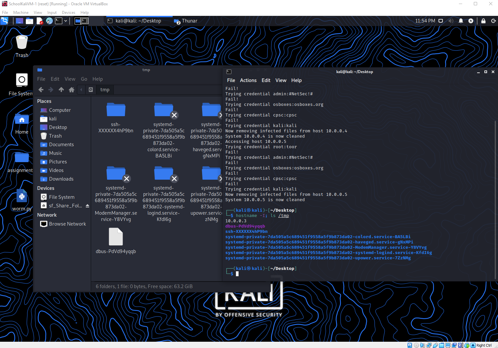
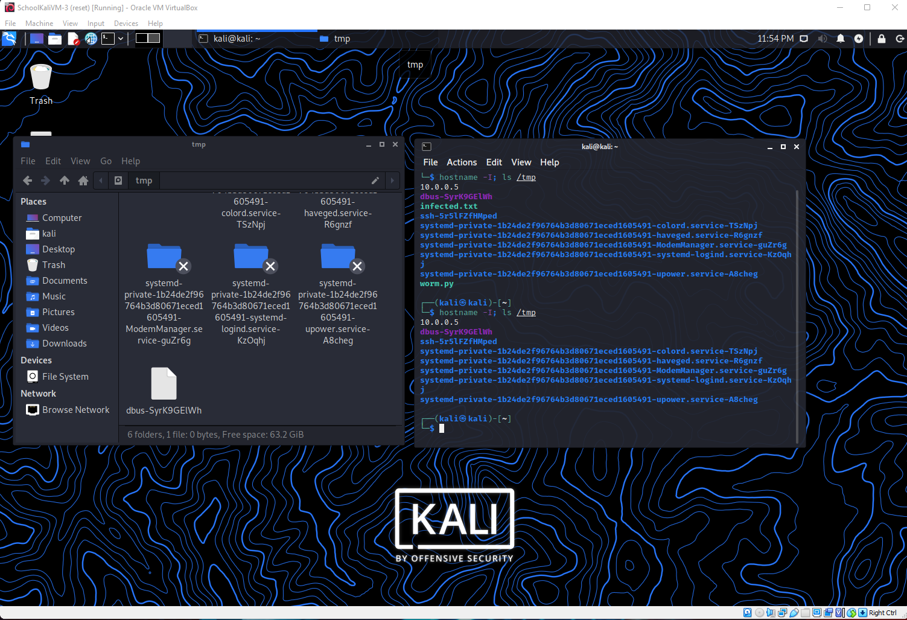

# CPSC 456 WORM Project

## Group members
Danny Diep, Luciano Gibertoni, Steven Chiang

## Prerequisites
Python 3.x

pip install paramiko netifaces python-nmap

pip install git+https://github.com/9b/pynetinfo

## Start GNS 

Create a topology as following:



## Configure Router
```
R1# conf t
R1(config)# int f0/0
R1(config-if)# ip add 10.0.0.1 255.255.255.0
R1(config-if)# no shut

R1(config-if)# service dhcp
R1(config)# ip dhcp pool BLUE
R1(dhcp-config)# lease 7 0 0
R1(dhcp-config)# network 10.0.0.0 255.255.255.0
R1(dhcp-config)# default-router 10.0.0.1
R1(dhcp-config)# ip dhcp excluded-address 10.0.0.1
R1(dhcp-config)# do wr
R1(config)# exit
```


## Setup VPCS
``` 
PC1> sh ip
NAME        : PC1[1]
IP/MASK     : 0.0.0.0/0
GATEWAY     : 0.0.0.0
DNS         :
MAC         : 00:50:79:66:68:00
LPORT       : 20006
RHOST:PORT  : 127.0.0.1:20008
MTU:        : 1500

PC1> ip dhcp
DDORA IP 10.0.0.2/24 GW 10.0.0.1
```



## Start ssh services on all kali hosts (if port 22 is not openned)
```
$ sudo service ssh start
```

## Start Worm.py
```
$ cd ~/path-to-worm.py
$ python3 worm.py
```
## Process of infecting the host within the network



## Proof the system is infected
```
$ hostname -I; ls /tmp
```




## Clean the infected files from host on the network
```
$ python3 worm.py -clean
```


## Proof the hosts are cleaned





